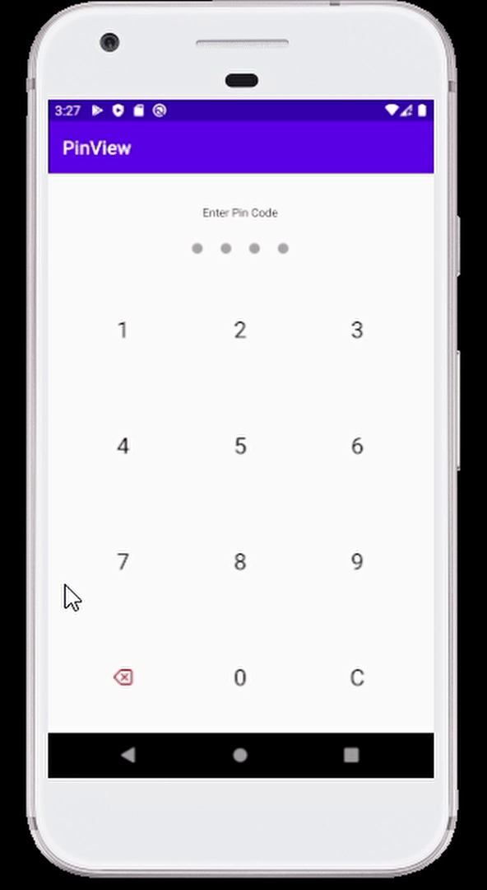
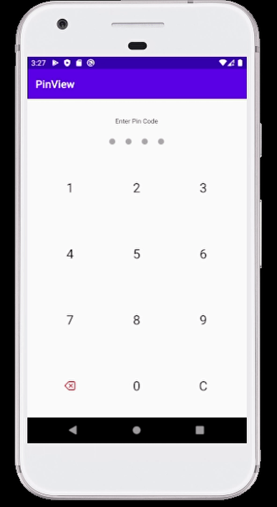
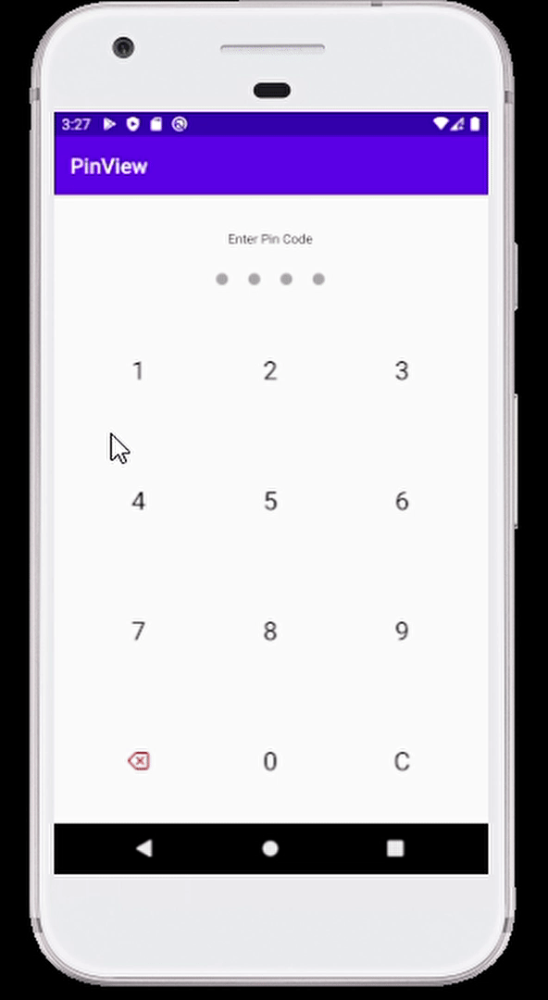

<h1 align="center" >
    PinView - Kotlin library
</h1>

### A customizable Pin Code entry view that can be used as a user login authentication method in your project.



# Installation

1. in project's build.gradle , add jitPack.io as following

```
	allprojects {
	   repositories {
           .....
           .....
	      maven { url "https://jitpack.io" }
	   }
	}
```

2. in module's build.gradle , add the implementation as following

``` dependencies {
        .....
        .....
        implementation 'com.github.khaled2252:pin-view:1.0.0'
    }
 ```

# Usage

1. Add PinView to your acivity/fragment.xml

```xml
 <com.khaledahmedelsayed.pinview.PinView
        android:id="@+id/pinView"
        android:layout_width="match_parent"
        android:layout_height="match_parent"
        app:errorMessageText="Invalid Pin Code"
        app:dotProgressColor="@android:color/holo_purple"
        app:titleName="Enter Pin Code">
    </com.khaledahmedelsayed.pinview.PinView>
```

2. Reference it in your activity/fragment class

    ```kotlin
    pinView.clearPin()
    pinView.deleteLastPin()
    ```
    ### Methods
    `pinView.clearPin()`  -> clears current pin progress
    
    `pinView.deletePin()` -> deletes last pin code number
    
    `pinView.showError(true)` -> displays an error message
    
    `pinView.showError(false)` -> hides the error message
    
    `pinView.isErrorVisible()` -> returns true if the error message is visible

    ### Listeners
    There are 2 listeners that can be used as following :-

    1. OnCompletedListener() which is called when user enters the ***4th pin number***
    
    ```Kotlin
    pinView.setOnCompletedListener = { pinCode ->

            if(pinCode == "1234")
                startActivity(Intent(this,HomeActivity::class.java))

            else
                pinView.showError(true)

            pinView.clearPin()
        }
    ```
    

    2. onPinKeyClickedListener() which is called when user clicks on ***any key*** in the pin keyboard (except for the 4th pin number)

    ```kotlin
        pinView.setOnPinKeyClickListener = { keyPressed ->
            Toast.makeText(this,"Key pressed was $keyPressed",Toast.LENGTH_SHORT).show()
        }
      ```
     

# Customization
    You can customize PinView's attributes using app namespace in xml as following :-

`app:titleTextColor=""`

`app:titleTextSize=""`

`app:dotProgressColor=""`

`app:dotUnProgressColor=""`

`app:dotRadius=""`

`app:numbersTextColor=""`

`app:numbersTextSize=""`

`app:deleteButtonColor=""`

`app:clearButtonColor=""`

`app:errorMessageText=""`

`app:errorMessageTextSize=""`

`app:errorMessageColor=""`


# Changelog
### Version: 1.0

  * Initial Build

## License
  
    Copyright 2020 Khaled
    
    Licensed under the Apache License, Version 2.0 (the "License");
    you may not use this file except in compliance with the License.
    You may obtain a copy of the License at
    
        http://www.apache.org/licenses/LICENSE-2.0
    
    Unless required by applicable law or agreed to in writing, software
    distributed under the License is distributed on an "AS IS" BASIS,
    WITHOUT WARRANTIES OR CONDITIONS OF ANY KIND, either express or implied.
    See the License for the specific language governing permissions and
    limitations under the License.